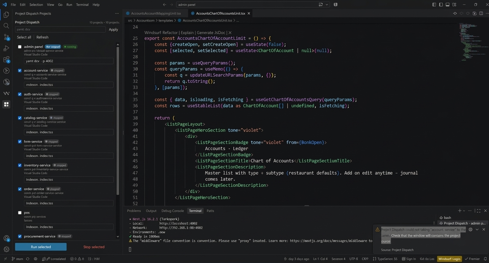

# Project Dispatch

Run one command across every project you already have open.

When several apps are running locally — an API, a web app, a worker — each one lives in its own VS Code or Cursor window. Starting or stopping them means finding each window and typing the same kind of command again. Project Dispatch puts those folders in one list so you can start, stop, and check them together.

You stay in one window and run every selected project from there. Each command starts in that project's own terminal, and the list shows whether it is running, finished, or failed. A saved command is filled in the next time that project is open, and clicking its name brings that window to the front.

## What it does

- Lists every folder open in a VS Code or Cursor window where this extension is installed.
- Fills in a start command when a project has a `dev`, `start`, or `serve` script in `package.json`. The package manager comes from the lockfile: Bun, pnpm, Yarn, or npm.
- Keeps a command you type yourself, so the next time that project appears it is already filled in.
- Runs the selected commands in each project's own terminal. A terminal is named `Project Dispatch · folder-name`. Running again closes that terminal and starts the command over.
- Shows a live status beside each project: `starting`, `running`, `done`, `error`, or `stopped`. A command you start or stop yourself in that project's terminal updates the status too. With shell integration, success and failure follow the exit code.
- Opens side-by-side terminals when several selected projects belong to the same window. Turn this off with the `projectRunner.splitTerminals` setting.
- Brings a project's window to the front when you click its name.

## How to use it

1. Install Project Dispatch, then reload each VS Code or Cursor window you want to control. The extension has to be running in a window before that window's folders show up and before a command can run there.
2. Open the **Project Dispatch** icon in the Activity Bar.
3. Select the projects you want. **Select all** selects every row. **Apply** copies the command in the box at the top into every selected row.
4. Edit a command in its row if that project needs something other than the suggested script.
5. Click **Run selected**. Each command runs in that project's folder. Projects in other windows are started by the extension in those windows.
6. Click **Stop selected** to close the Project Dispatch terminals for those projects.
7. Click a project name to switch to its window.

The list refreshes on its own. **Refresh** reloads it immediately. A project that does not respond still needs its window open, with this extension installed.

## 0.4.4

Status now follows the project's own terminal, not only **Run selected** and **Stop selected**.

- Starting a command yourself in that project's terminal sets the row to `running`.
- Stopping it with Ctrl+C, or closing the terminal, sets the row to `stopped`.
- A command that finishes on its own shows `done`. A non-zero exit shows `error`.

Shell integration has to be enabled in that window. VS Code and Cursor turn it on by default.

## Requirements

- VS Code or Cursor 1.93 or newer.
- A folder opened in each window you want to include. An empty window does not appear in the list.
